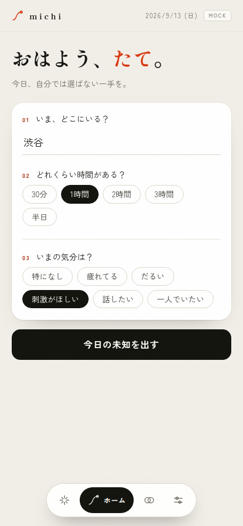
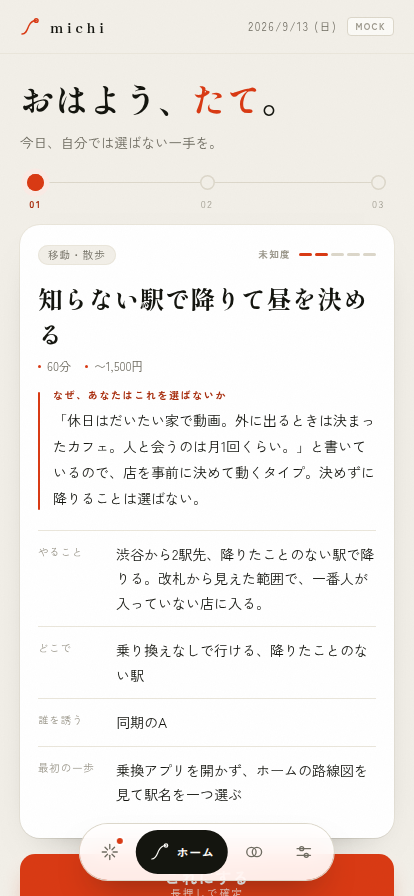
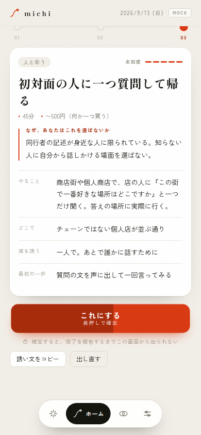
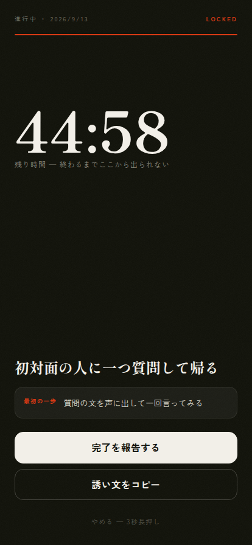
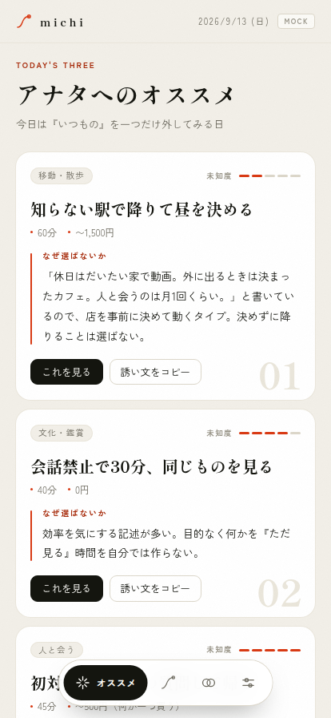
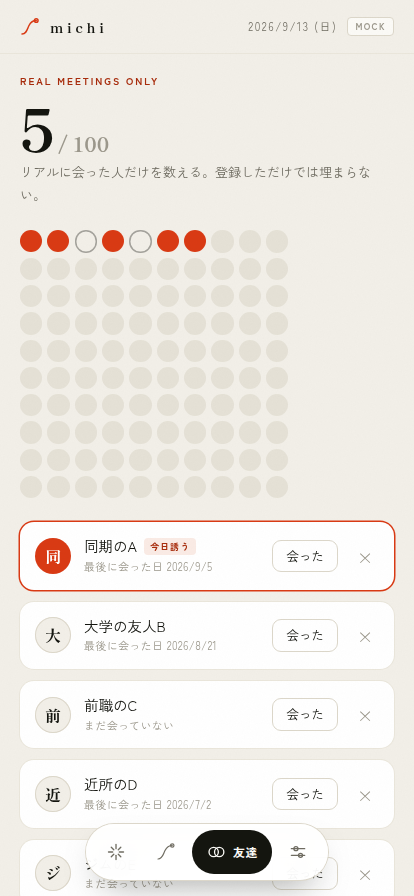
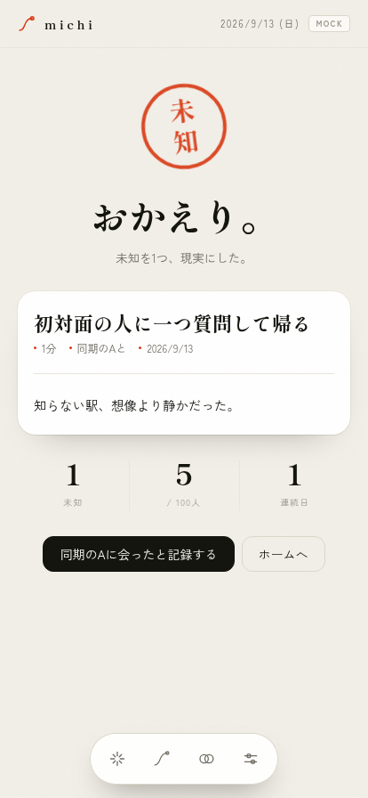
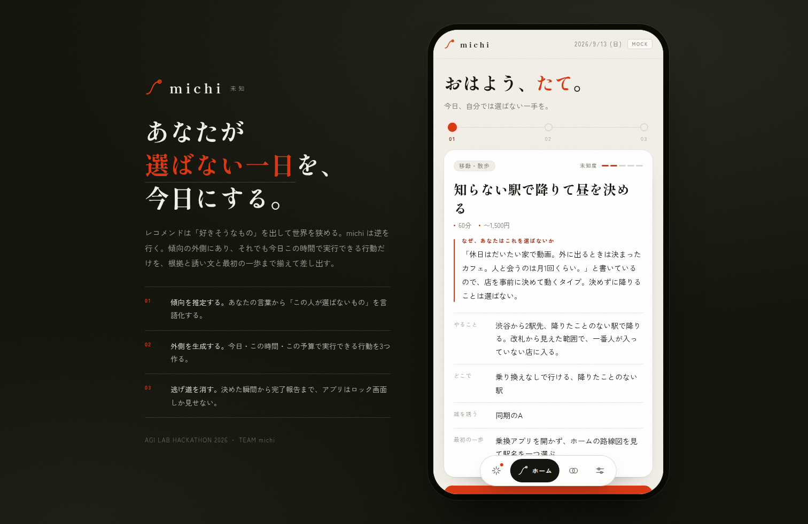

# michi — 未知イベント提案アプリ

「自分では選ばない体験」を、今日この後の予定としてAIが3つ提案する。
提案には必ず **なぜあなたはこれを選ばないか（根拠）** と **誰を誘うか・誘い文** と **60秒でできる最初の一歩** が付く。

- **仕様書: [docs/spec.md](docs/spec.md)**
- アイデアの経緯: [docs/2026-09-13-unknown-event-app.md](docs/2026-09-13-unknown-event-app.md)
- ハッカソン要件・進行・発表構成: [docs/hackathon-brief.md](docs/hackathon-brief.md)

## 動かす

```bash
npm install
cp .env.example .env      # ANTHROPIC_API_KEY を入れる
export $(grep -v '^#' .env | xargs)
npm start                 # http://localhost:3000
```

APIキーが無いときは自動で **モックモード**（固定の3案を返す）で起動する。UIの確認・発表リハはこれで足りる。
明示的にモックで動かすなら `npm run mock`。

## 画面

| | |
|---|---|
|  |  |
| **ホーム** — エリア・時間・気分だけ。3タップで出せる | **今日の未知** — 路線図ナビ（01/02/03）と未知度ゲージ。主役は「なぜ、あなたはこれを選ばないか」 |
|  |  |
| **長押しで確定** — 朱が満ちたら不可逆。やめる（3秒長押し）と対称 | **ロック** — 完了報告までこの画面しか出ない |
|  |  |
| **アナタへのオススメ** — 3案を並べて比較 | **友達** — 100マスの盤面。朱＝リアルに会った人 |
|  |  |
| **おかえり** — 朱の「未知」印が捺される | **PC表示** — 端末フレーム＋ピッチ面 |

## デザイン

| 項目 | 決め |
|---|---|
| 色 | 墨 `#14150F` / 生成紙 `#F2EFE8` / **朱 `#D93A14`**。強調はこの2色だけ。**黒＝進む、朱＝確定・不可逆**という役割分担を全画面で守る |
| 書体 | 見出し・数字は明朝（`Shippori Mincho B1` → Hiragino Mincho ProN / Yu Mincho にフォールバック）、UIは `Zen Kaku Gothic New`。CDNが落ちても端末の明朝で成立する |
| 反復モチーフ | **「道」の線**。ロゴ、3案の路線図ナビ、ロックの残時間バー、完了の印まで同じ発想を回す |
| 質感 | 紙のグレイン（インラインSVGノイズ）。影より罫線と余白で階層を作る。グラデーション・グラスモーフィズム・絵文字アイコンは使わない |
| 動き | `cubic-bezier(.16,1,.3,1)` の段差フェード、ロックは下からのワイプ、完了印はスプリング。`prefers-reduced-motion` で全停止 |
| PWA | `manifest.webmanifest` + `icon.svg`。iPhone / Android のホーム画面に入れて全画面で動く |

依存ライブラリは0。`public/index.html` の1ファイルにCSS・JS・SVGすべてが入っている。

## 構成

| ファイル | 役割 |
|---|---|
| `server.js` | Express。`POST /api/suggest` で Claude（`claude-opus-5`）を呼び、Zodスキーマで構造化出力を保証 |
| `public/index.html` | スマホ型の単一ページ（依存なし）。ホーム／アナタへのオススメ／友達／設定の4タブ＋**ロック画面**（「これにする」の長押し確定から完了報告まで他の画面に戻れない） |
| `public/manifest.webmanifest`, `public/icon.svg` | PWA。ホーム画面に追加すると全画面で起動する |
| `docs/screens/*.png` | 実機サイズのスクリーンショット（Playwrightで自動取得） |
| `docs/codex-image-prompts.md`, `docs/prompts/*.txt` | 初期スケッチ向けの画像生成プロンプト集（現UIより前の版） |
| `.env.example` | 環境変数のひな形 |

### API

`POST /api/suggest`

```json
{ "area": "渋谷", "minutes": "60", "mood": "何か刺激がほしい",
  "budget": "〜1,000円", "recent": "休日はだいたい家で動画", "companion": "同期のA" }
```

レスポンス: `one_liner` と `proposals[3]`（`title, category, distance, why_you_wouldnt_pick, what, where_hint, duration_min, cost_hint, invite_who, invite_message, first_step, emotion`）。

`distance` は **未知度 1〜5**（1＝少し外側 / 5＝完全に圏外）。UIの未知度ゲージになる。

`GET /api/health` → `{ ok, mode: "live" | "mock", model }`
